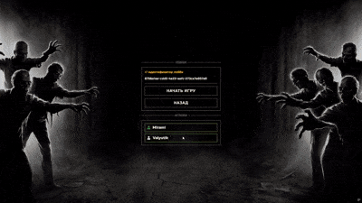

# Multiplayer-Roguelike

## 🎲 Описание проекта
**Multiplayer-Roguelike** – это многопользовательская кооперативная игра в жанре roguelike с видом сверху. Игроки сражаются с волнами зомби, используя различное оружие. Проект реализован с разделением на выделенный сервер и клиентную часть на Unity.

## ⚙️ Архитектура и Технологии
Проект разработан с упором на чистую архитектуру и производительность сетевого кода.

### Архитектурные паттерны:
*   **Backend (Сервер):** **MVP (Model-View-Presenter)** – четкое разделение данных (Model), логики представления (Presenter) и сетевого взаимодействия.
*   **Frontend (Клиент):** **ECS (Entity Component System)** – высокопроизводительная архитектура для обработки множества игровых объектов.

### Используемые технологии:
*   **Unity 6** (6000.3.9f1)
*   **C# / .NET 8**
*   **ENet** – библиотека для надежного UDP-взаимодействия
*   **DotRecast** – библиотека для навигации и построения NavMesh (аналог Recast/Detour)

### Структура решения:
*   `Multiplayer-Roguelike.Shared` – Общая библиотека (netstandard2.1). Содержит модели данных, команды и протоколы, используемые и клиентом, и сервером.
*   `Multiplayer-Roguelike.Backend` – Выделенный сервер (.NET 8 Console App). Управляет игровой сессией, логикой врагов и обработкой команд.
*   `Multiplayer-Roguelike.Unity` – Клиентская часть (Unity). Отвечает за ввод, отрисовку, UI и отправку команд на сервер.

## 🚀 Игровые механики

### `Боевая система`
*   **Различное оружие:** Ближний бой (бита) и дальнобойное (пистолет).
*   **Тактическое взаимодействие:** Кооперативная стрельба и смена позиций.
*   **Волны врагов:** Система спавна, которая адаптируется под количество игроков и номер волны.

### `Сетевое взаимодействие`
*   **Архитектура "Авторитетный сервер":** Вся игровая логика (урон, смерть, перемещение врагов) рассчитывается на сервере.
*   **Система команд (Command Pattern):** Клиент отправляет команды (Move, Attack, SwitchWeapon), сервер их валидирует и исполняет.
*   **Синхронизация состояний:** Использование бинарного протокола для передачи только изменившихся данных (Delta Compression через `IsDirty` флаги).

### `Навигация и AI`
*   **Server-Side Navigation:** Использование библиотеки DotRecast для расчета пути врагов на сервере.
*   **NavMesh:** Загрузка предрассчитанного NavMesh (`base.navmesh`) для передвижения врагов.
*   **Crowd Simulation:** Использование Detour Crowd для обработки столкновений и скоплений врагов.

### `Технические особенности`
*   **Кастомный ECS на клиенте:** Реализован легковесный ECS для управления сущностями без накладных расходов DOTS.
*   **Объекты пула (Pooling):** Использование пулов для партиклов (стрельба, кровь, смерть) для оптимизации производительности.
*   **Интерполяция:** Сглаживание движения сетевых объектов (`PositionInterpolationSystem`) для компенсации задержки.

## 🛠️ Установка и запуск

### Требования:
*   Unity 6000.3.9f1 или новее
*   .NET 8 SDK

### Запуск:
1.  **Сервер:**
    *   Открыть решение `Multiplayer-Roguelike.Backend.sln`.
    *   Собрать и запустить проект `MultiplayerRoguelike.Backend`.
2.  **Клиент:**
    *   Открыть папку `Multiplayer-Roguelike.Unity` в Unity Hub.
    *   Открыть сцену `MainScene`.
    *   Запустить игру.

---

**Итог:** Multiplayer-Roguelike демонстрирует подход к разработке сетевых игр с использованием паттернов Command и MVP на сервере и ECS на клиенте.
